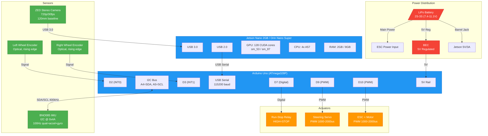

# Circuit Connection Diagram

## Mermaid Diagram



## Detailed Wiring Table

| From | Pin/Port | Wire | To | Pin/Port | Notes |
|------|----------|------|----|----------|-------|
| ZED Camera | USB-C | USB 3.0 cable | Jetson | USB 3.0 port | Data + power |
| Jetson | USB 2.0 port | USB-B cable | Arduino | USB-B | Serial 115200 + power |
| Arduino | A4 (SDA) | 2-wire | BNO085 | SDA | I2C data, 400 kHz |
| Arduino | A5 (SCL) | 2-wire | BNO085 | SCL | I2C clock |
| Arduino | 3.3V | power | BNO085 | VIN | 3.3V supply |
| Arduino | GND | ground | BNO085 | GND | Common ground |
| Arduino | D2 (INT0) | signal | Encoder L | OUT | Rising edge ISR |
| Arduino | D3 (INT1) | signal | Encoder R | OUT | Rising edge ISR |
| Arduino | 5V | power | Encoder L | VCC | 5V supply |
| Arduino | 5V | power | Encoder R | VCC | 5V supply |
| Arduino | GND | ground | Encoders | GND | Common ground |
| Arduino | D9 | signal | Steering Servo | PWM | 1000-2000 us |
| Arduino | D10 | signal | ESC | PWM | 1000-2000 us |
| Arduino | D7 | signal | Run-Stop Relay | IN | HIGH=stop, LOW=run |
| BEC | 5V out | power | Servo | VCC | 5-6V servo power |
| BEC | 5V out | power | Arduino | VIN or 5V | Arduino power (alt) |
| LiPo | Balance lead | power | ESC | Battery | Motor power |
| LiPo | Balance lead | power | BEC | Input | 5V regulation source |
| LiPo | Barrel adapter | power | Jetson | Barrel jack | 5V/3A (via converter) |

## Power Budget

| Component | Voltage | Max Current | Power |
|-----------|---------|-------------|-------|
| Jetson Nano 2GB | 5V | 3A | 15W |
| ZED Camera | 5V (USB) | 0.5A | 2.5W |
| Arduino Uno | 5V (USB) | 0.2A | 1W |
| BNO085 | 3.3V | 0.05A | 0.17W |
| Steering Servo | 5-7.4V | 2A (stall) | 10W peak |
| ESC + Motor | 7.4-11.1V | 30A (peak) | 330W peak |
| Wheel Encoders | 5V | 0.02A | 0.1W |
| **Total (idle)** | | | **~20W** |
| **Total (max)** | | | **~360W** |

## Jetson Nano 2GB vs Orin Nano Super

Both boards use the same wiring. The only differences:

| Feature | Nano 2GB | Orin Nano Super |
|---------|----------|-----------------|
| USB 3.0 | 1 port | 2 ports |
| USB 2.0 | 2 ports | 1 port |
| GPIO | 40-pin header | 40-pin header |
| Power | 5V/3A barrel | USB-C PD |
| GPU | 128 cores (sm_53) | 1024 cores (sm_87) |
| RAM | 2 GB | 8 GB |
| CUDA | 10.2 | 12.x |

The Arduino connects via USB 2.0, ZED via USB 3.0. Pin-compatible for swap.

## SchemeIt Component List

For creating a professional schematic in [Digikey SchemeIt](https://www.digikey.com/schemeit/):

### Components to Place

| # | Component | SchemeIt Symbol | Value/Label |
|---|-----------|----------------|-------------|
| 1 | NVIDIA Jetson Nano | Generic IC (40-pin) | "Jetson Nano 2GB" |
| 2 | Arduino Uno | Arduino Uno symbol | "ATmega328P" |
| 3 | BNO085 | Generic IC (8-pin) | "BNO085 IMU" |
| 4 | ZED Camera | Camera symbol | "ZED Stereo" |
| 5 | Servo Motor | Motor symbol | "Steering Servo" |
| 6 | ESC | Generic IC | "ESC + BL Motor" |
| 7 | Optical Encoder x2 | Sensor symbol | "Wheel Encoder" |
| 8 | Relay | SPST Relay | "Run-Stop" |
| 9 | LiPo Battery | Battery symbol | "2S-3S LiPo" |
| 10 | BEC | Voltage regulator | "5V BEC" |
| 11 | USB 3.0 Connector | USB symbol | "USB 3.0" |
| 12 | USB-B Connector | USB symbol | "USB Serial" |

### Net List (Connections)

```
# Power nets
NET BAT_POS: LiPo.+ -> ESC.BAT+, BEC.VIN, JETSON_CONV.VIN
NET BAT_NEG: LiPo.- -> ESC.BAT-, BEC.GND, JETSON_CONV.GND
NET VCC_5V:  BEC.VOUT -> Arduino.5V, Servo.VCC, Encoder_L.VCC, Encoder_R.VCC
NET VCC_3V3: Arduino.3V3 -> BNO085.VIN
NET GND:     Common ground bus (all components)

# Data nets
NET USB3:    ZED.USB -> Jetson.USB3.0
NET USB_SER: Jetson.USB2.0 -> Arduino.USB-B
NET I2C_SDA: Arduino.A4 -> BNO085.SDA (pull-up 4.7k to 3.3V)
NET I2C_SCL: Arduino.A5 -> BNO085.SCL (pull-up 4.7k to 3.3V)

# Signal nets
NET ENC_L:   Encoder_L.OUT -> Arduino.D2
NET ENC_R:   Encoder_R.OUT -> Arduino.D3
NET STEER:   Arduino.D9 -> Servo.PWM
NET THROT:   Arduino.D10 -> ESC.PWM
NET ESTOP:   Arduino.D7 -> Relay.IN
```

### SchemeIt Import Steps

1. Go to [schemeit.com](https://www.digikey.com/schemeit/)
2. Create new schematic
3. Place components from the table above
4. Connect using the net list
5. Add power symbols (VCC, GND) and labels
6. Add title block: "TruggyAD Circuit Diagram v1.0"

### I2C Pull-up Detail

```
        3.3V
         │
        ┌┤ 4.7kΩ
        │├
        │
A4 ─────┼──── BNO085 SDA
        │
        │
        3.3V
         │
        ┌┤ 4.7kΩ
        │├
        │
A5 ─────┼──── BNO085 SCL
```

Note: BNO085 breakout boards (Adafruit) typically include pull-ups. Check your board before adding external ones.
